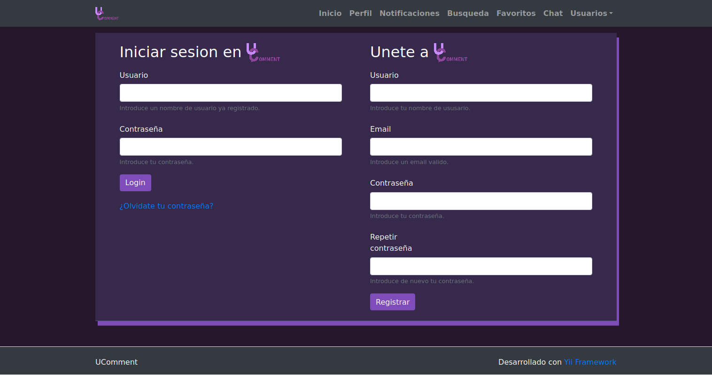
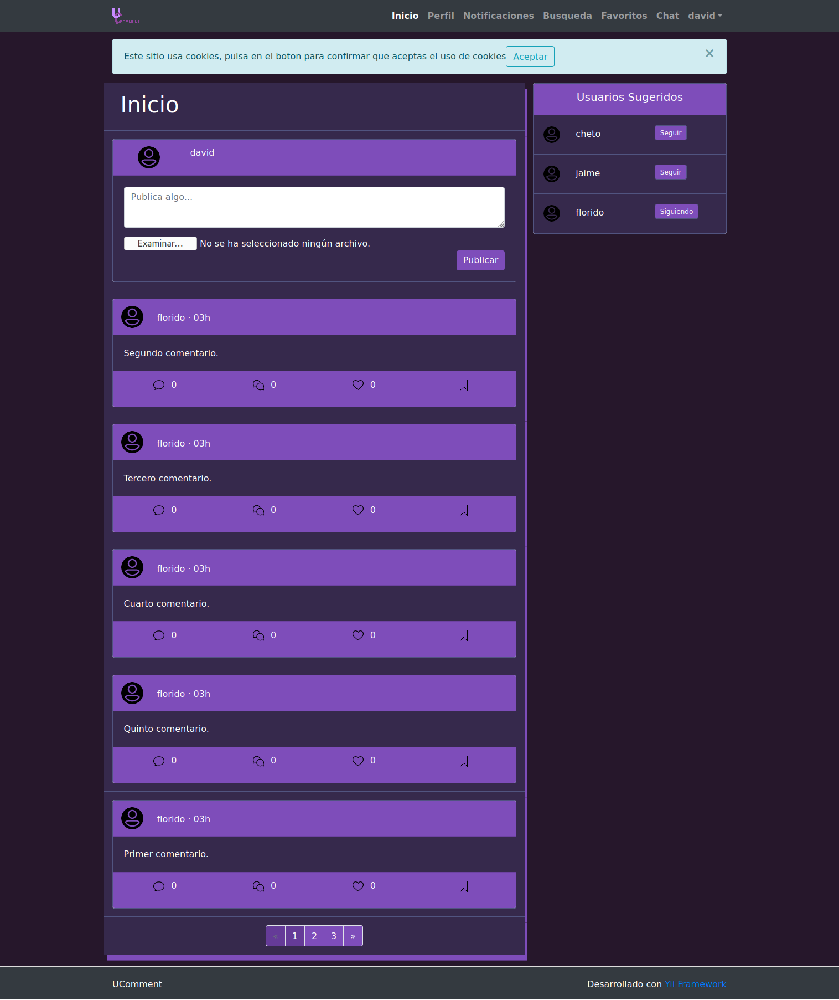
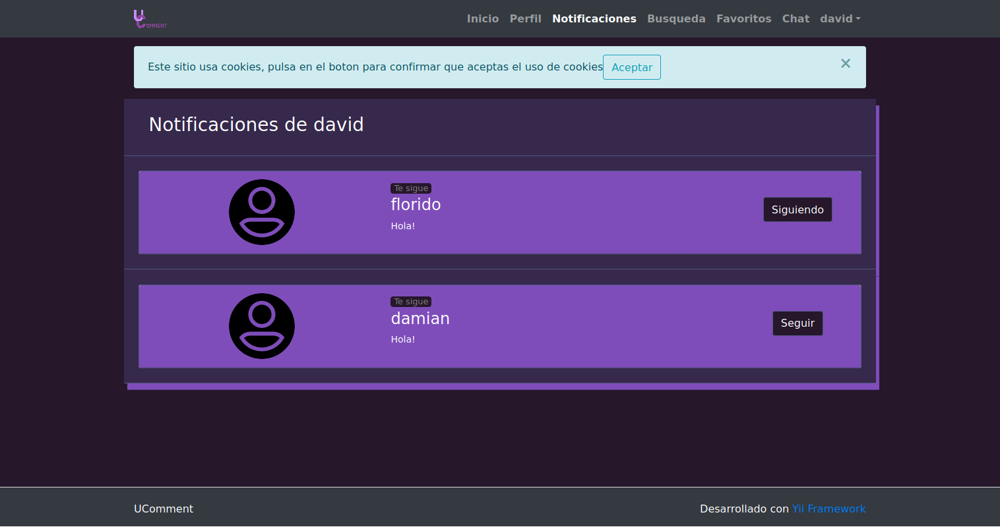
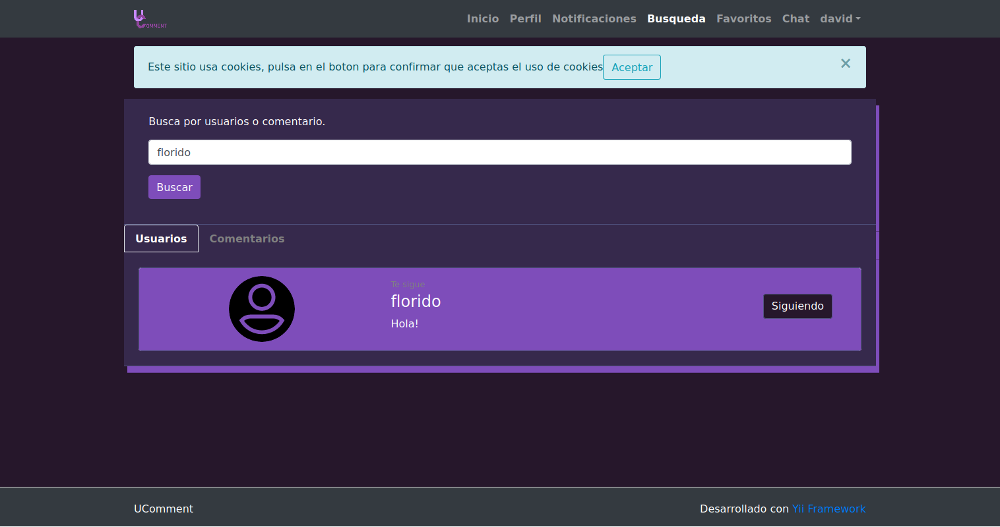
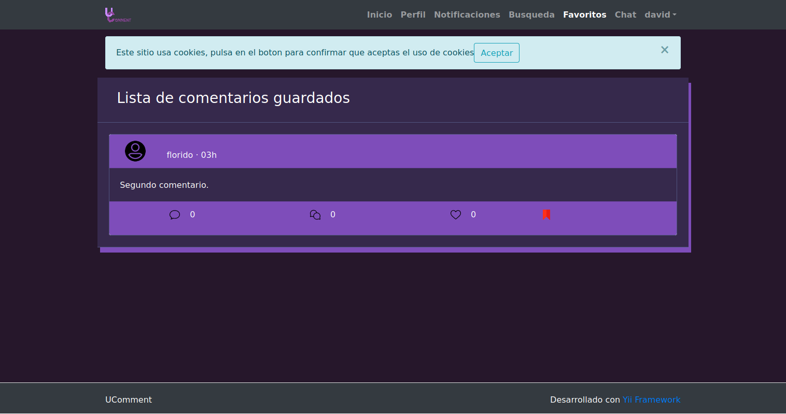
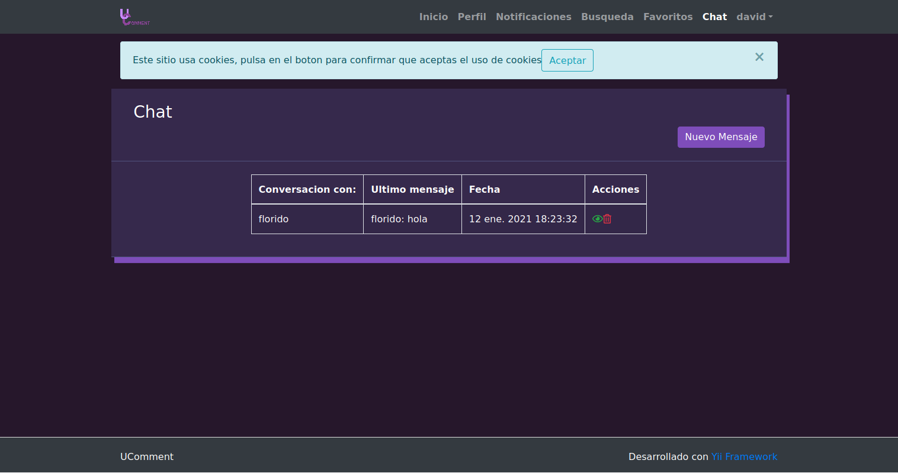
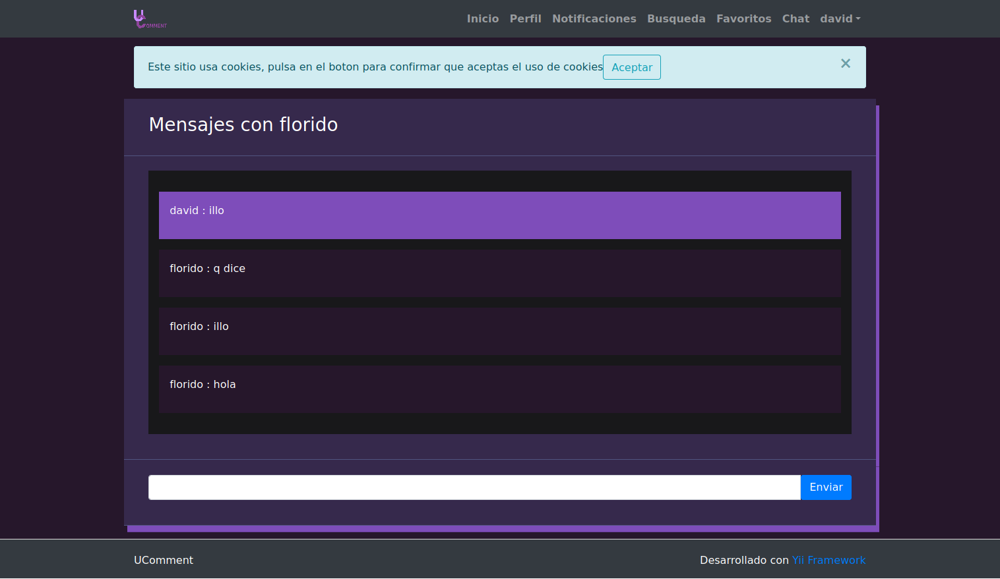

# Manual de usuario

Register y login de usuarios, tambien se puede recuperar la contraseña.

Aqui tenemos la pagina de inicio de sesion donde podemos seguir a otros, repsonder a los comentarios de los que ya seguimos o guardar sus comentarios.

Cada usuario tiene un perfil personal

Los usuarios logueados tienen acceso a un apartado de notificaciones donde podran ver quien responde, cita, da like a sus comentarios o incluso quien le sigue.

El usuario logueado tendra una busqueda para poder bucar comentarios o usuarios.

Un usuario podra guardar comentarios favoritos para no perderlos o guardarlos para mas tarde.

Los usuarios logueados tendran un chat entre si para poder hablar entre ellos cuando esten online dentro de la aplicacion.

